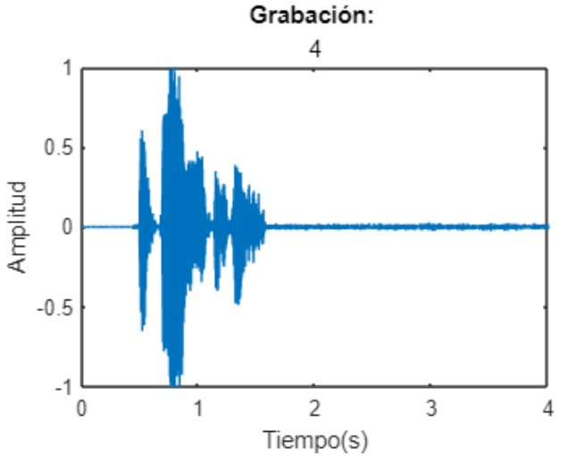
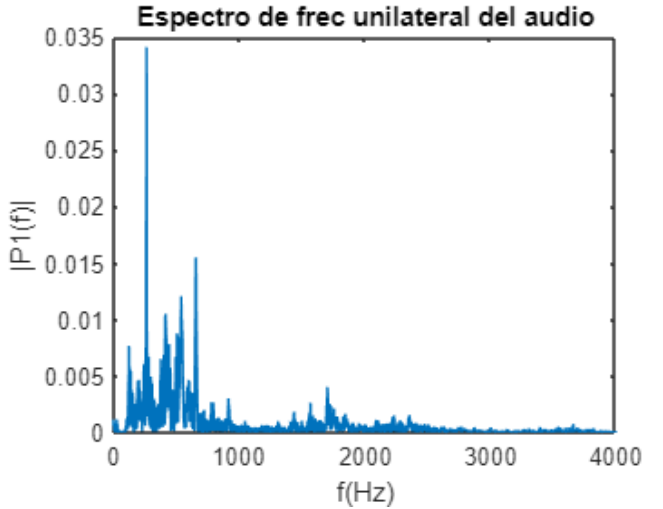
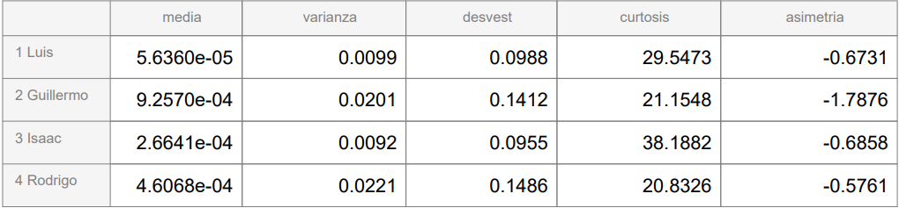

## Career Portfolio

### About Me
I am currently studying the sixth semester on Robotics and Digital Systems, on Instituto Tecnológico y Estudios Superiores de Monterrey, on Mexico.

### Design of a Biometric System for Voice Signals Processing
The goal of this project was to identify different voices using mathematical and statistical functions. This code was done using MATLAB, and allowed users to record their voices and analyze them. The most important function was the Fourier Fourier Transform, to find the most present frequencies. Then, we used statistical analysis to find the differences between the voice recordings, and display graphs and tables.

<table style="width:100%">
<tr>
<td>

</a>
</td>
<td>
</a>
</td>
<td>

</a>
</td>
</tr>
<tr>
<td>
Voice recording's decibels amplitud
</a>
</td>
<td>
Frecuency analysis 
</a>
</td>
<td>
Table for statistical analisis
</a>
</td>
</tr>
</table>
___

### Intelligent Platform of Air Pressure Prototype on Agricultural Equiment
The main goal of this project, which we worked on with John Derre, was to implement a controller to allow a bag to inflate or deflate depending on the internal pressure of it, which represented a tire. Using a closed-loop controller, we read the data from the a pressure sensor to determine the internal pressure of the bag, while an air pump and a solenoid valve were turned on and off to let the air flow to or from the bag. We used an STM32 microcontroller to apply the control, including the sensor and the actuators, as well as the LCD display and the CAN, SPI and L2C communication.

Along with this, we also created a digital interface using Arduino Cloud, to view the pressure and determine de desired one. The communication was possible thanks to a CAN protocol, the ESP32 and the CAN modules. Finally, we used an extra sensor to read the movement of our plant. With this, we used the Fast Fourier Transform to analyze the frequency of the vibrations. 

<table style="width:100%">
<tr>
<td>

</a>
</td>
<td>

</a>
</td>
<td>

</a>
</td>
</tr>
<tr>
<td>
Control Diagram
</a>
</td>
<td>
Vibration Analisis
</a>
</td>
<td>
Esquematic
</a>
</td>
</tr>
<tr>
<td>

</a>
</td>
<td>

</a>
</td>
</tr>
<tr>
<td>
Presented Plant
</a>
</td>
<td>
LCD display
</a>
</td>
</tr>
</table>


Arduino Cloud interface
___

### Colaborative Robotized Chores on Real Envirornment Solution
On this project, we used a Geared Motor with Encoder, so thta we could read the position and velocity of it. This was donde using Arduino, and with MATLAB we implemented a PI controller to give the command to the motor of how many spins it should make, or what velocity in should have. This control was tested in MATLAB, so that we could determine if it was the right one to use, one for the poistion control and another for the velocity one. 
All of this communication was done using ROS Nodes, so that we learned how to use Subscribers and Publishers, as well as the implementation of a closed-loop PID control.

### Markdown

Markdown is a lightweight and easy-to-use syntax for styling your writing. It includes conventions for

```markdown
Syntax highlighted code block

# Header 1
## Header 2
### Header 3

- Bulleted
- List

1. Numbered
2. List

**Bold** and _Italic_ and `Code` text

[Link](url) and 
```

For more details see [GitHub Flavored Markdown](https://guides.github.com/features/mastering-markdown/).

### Roadmap

See the [open issues](https://github.com/evanca/quick-portfolio/issues) for a list of proposed features (and known issues).
___

### References

[1] Jekyll theme "Minimal" for GitHub Pages: https://github.com/pages-themes/minimal (CC0 1.0 Universal License)
<br>[2] Dummy photo via: https://pixabay.com/photos/man-male-adult-person-caucasian-1209494/ (Pixabay License)
<br>[3] Dummy thumbnail image created by rawpixel.com: https://www.freepik.com/free-vector/set-elements-infographic_2807573.htm (Standard Freepik License)
